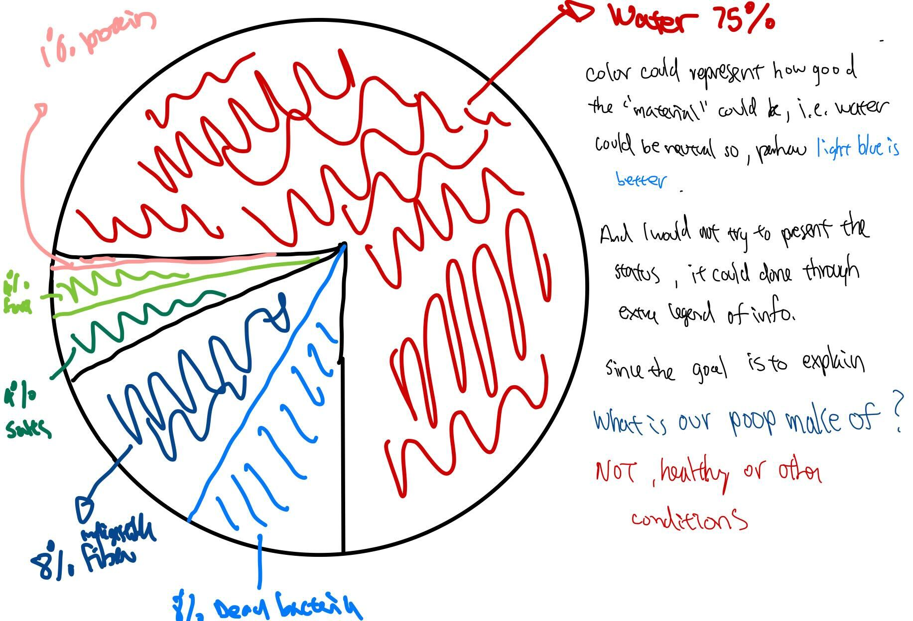
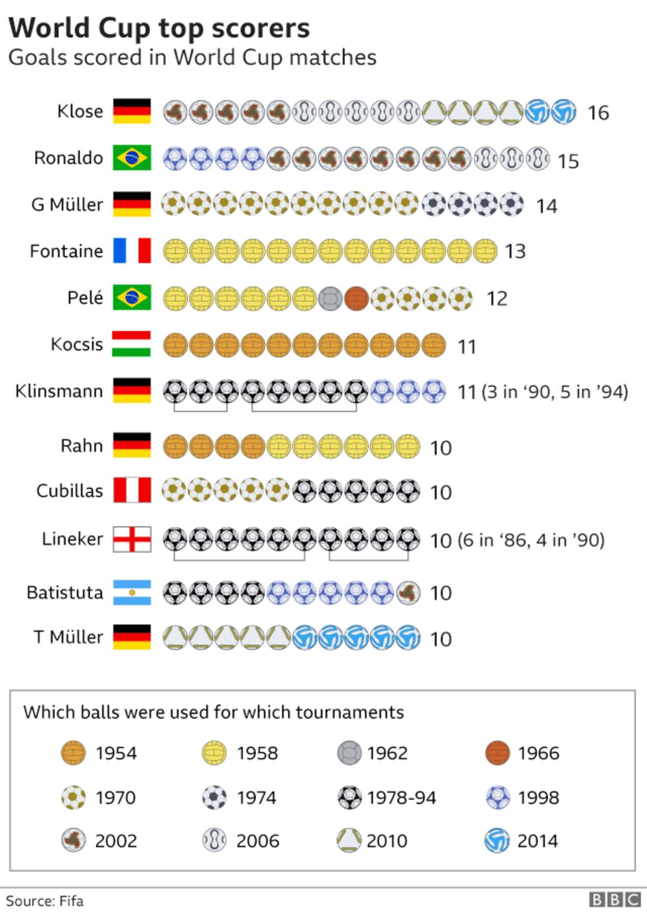

# Given Vis. Critique

Let **item** be the **POOP**

### Data Represented:
The data here is represented by graphics similar to "Pie Chart, whereas we could see that each portion of the item is divided by proportions of size that they occupy (except for the majority portion which is water, that has a weird shape). Moreover, these proportions are labelled by color differentiating distinct forms/status (normal/bleed or etc) of the item. So we have two features here: 

- `Health Status` , nominal, this stands for status of the item from what person
- `Nutrient/material`, quantitave, this stands for constitution of the proportion of item (water/dead bacteria/fats or more)

### Data encoding:

> Let **item** be the **POOP**

The mark used here is like a combination of `mark_arc` and `mark_area`, essentially pie chart and filled area plot. Then, it is hard to tell which channels it encodes, very unlikely to have an axis of `x` and `y` (at least I can't imagine it out). Therefore, known channels are like `color`, where each proportion not only represented the consitution of that part but also displaying different health status of the item; `text` is also present to label what proportion is. In addition, `opacity` also exists, where a distinct opaque color could mean a problem in the health status. Lastly, a less obvious could be `size`, where I argue that larger the numeric proportion it is, also the larger is the that part of the item visually.

### Critique the visualization by expanding on the characteristics of the channels and how they are suited for the given attribute

> Let **item** be the **POOP**

Using the `text` label is suitable in this context, since it could clearly tell what we are interested in (composition of the item). Then, `size` is also adequate here, since it ilustrate the magnitude of the proportion of each subpart of the item, altought could be ineffective when too much subparts. On the other hand, the `color` channel is not quite useful here, it requires an extra legend to denote the health status, and this could be easily forgetted by user, plus, it's way too much information to know at once. 

`Text` and `size` explained the `Nutrient/material` feature. `Color` and `opacity` explained the `health_status` feature.

### Question the visualization answer:

> Let **item** be the **POOP**

This visualization tries to convey us how is the item composed by several material/cells/molecules , and what are the percentages of these in the item. And what a different color of the item could mean in terms of health status of a human being.

### Visualization is effective:

The visualization clearly explains that a different color and scale of hue could represent how healthy somebody is or at least if you're normal and not have other stomach issues

### Visualization is ineffective:

> Let **item** be the **POOP**

Not clear scale of the color is present, this could mislead the readers and accidentally misunderstand the health conidtion. Plus, many of the scale has a long range of say: `Normal`, which do not make natural sense, since its either `Normal` or other, instead of `Normal 20%` or `Normal 75%`. 

Other issue could be the `size` and the proportions of the item and its representation (not on same axis/plane?), the rounded chart makes it hard to denote the difference of two parts (protein and salts), since these two are far from readers and "wrapped-in".

# Given Vis. Redesign

# Selected Vis. Image and Reference

Retrieved from :[https://www.bbc.com/sport/football/44388118](https://www.bbc.com/sport/football/44388118)

# Selected Vis. Critique

### Data Represented:

The data is represented with name of player, country of the player, total number of goals, and goals are also differentiated by which year the ball was used when the player scored, whereas each of these balls look different as well. Note some goals are scored of a same time of the match (this could be hard to ilustrate). And it concludes to the following features:

- `Name` , nominal
- `Country`, nominal
- `Number of Goals`, quantitative
- `Ball year with shape` (quite hard to describe this), ordinal
- `Score time`, Temporal, possibly but is hard to describe, since not all players have it

### Data encoding:

This visualization likely used `mark_point`, but each of the point is a specific picture (another mark). Plus, the flags of the nationality could be of another mark that references url. Channels are like: `x` for goals, `y` for names, `text` for special annotations (times of goals).

### Critique the visualization by expanding on the characteristics of the channels and how they are suited for the given attribute

The use of a diifferent ball (x channel)of a year helped in popout, and we could clearly that a player scored many goals with that ball, which could tell us the player scored particularly many times in that World Cup (WC). Also, this shows a natural grouping, when a player scores many times in different WCs. The `y`channels has good discriminiability and accuracy, where we could see the distinct players and their country played sort by number of goals.

### Question the visualization answer:

Top scorers of soccer players in the World Cup, with number of goals scored in all their World cup matches.

### Visualization is effective:

We could see whom are the top scorers of World Cup, and the country they're from, specifically Brazilians and Germans scored quite a lot, this might also indicate they usually have good fowards in international competitions.

### Visualization is ineffective:

The different ball and corresponding year helped to denote which world cup a player scored a lot, but this could be an issue when the timeline is long enough, i.e. its hard now to tell which ball is which since they all look similar to each one. The special label of text to tell that some goals are scored at specific time could mislead readers, and questions why are only these times mentioned? and what about other goals? does it have special meaning?

` 
# Selected Vis. Redesign

